# 1. Comment utiliser Chocolatine

Pour utiliser Chocolatine vous avez plusieurs moyens, 
soit exécutez Chocolatine sur un Terminal et codez ligne par ligne : 

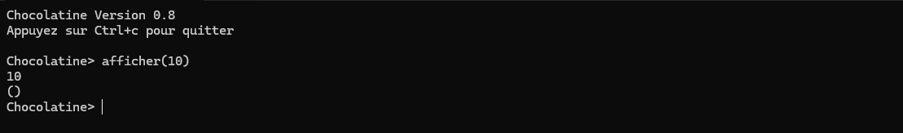

Soit coder depuis n'importe quel éditeur, créez votre code dans un fichier que vous exécuterez
Pour exécutez un fichier de code Chocolatine, utilisez la fonction  `charger` ou  `load` ou `lire` ou `ouvrir`

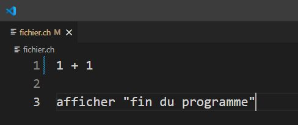
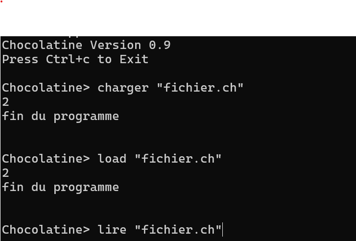

Syntaxe :
    `nom_fonction_charger "nom_du_fichier.extension"`

Exemples :

*  `charger "fichier.ch"`
*  `load "fichier.ch"`
*  `lire "fichier.extansion"`

/!\ Pensez à créer le fichier à la racine de l'exécutable Chocolatine, dans le même dossier.

------------------------------------------------------

# 2. Mathématiques

Les opérations de mathématique,`+` addition, `-` soustraction, `*` multiplication, `/`, division
On peut aussi utiliser des mots plutôt que des symboles mathématiques : `Plus`, `fois`, `multiplier par `, `diviser par` etc...

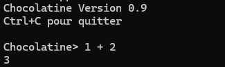
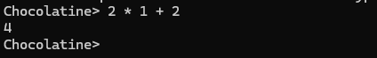
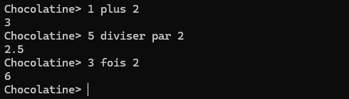

Syntaxe : 

*  `nombre opération nombre`
*  `opération nombre nombre` (exemple : + 2 2)

Exemples :

*  `2 + 3`
*  `10 - 3`
*  `10 / 2`
*  `2 plus 3`
*  `5 multiplier par 3`
*  `4 diviser par 3`

------------------------------------------------------

# 3. Affichage

Pour afficher du texte, il suffit d'utiliser la fonction `afficher`

/!\ Le texte doit être mis avec des   `" "` on peut également afficher des nombres

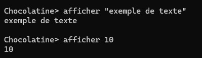

Syntaxe : 

*  `afficher valeur`

Exemples :

*  `Afficher "Lorem Ipsum"`
*  `afficher 10`

------------------------------------------------------

# 4. Variables

Les variables servent à stocker des valeurs dans la mémoire pour pouuvoir la réutiliser
Pour créer une variable il faut initier le nom de la variable puis sa valeur.

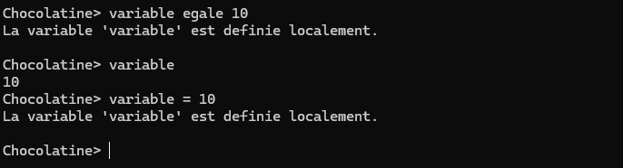

Syntaxe : 

*  `nom_de_la_variable = valeur_souhaité`
* (avec " " de chaque côté des caractères)

Exemples :

*  `variable = -10`
*  `variable = "Caractère"`
*  `variable = 3`
------------------------------------------------------

# 5. Fonctions

Les fonctions permettent de faire une action en fonction de plusieurs paramètres donnés.

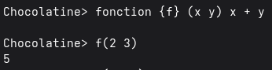

Syntaxe : 

*  `fonction {nom_de_la_fonction} (variables1 variable2 ...) action`

Exemples :

*  `fonction {f} (x y z) x + y + z`
*  `fonction {fun}(x) afficher(10+x)`
*  `fonction {f} (x y) `

-----------------------------------------------------

# 6. Conditions

Les conditions permettent de faire appel à une fonction avec une condition

(NB : dans les exemples en dessous X = 9, Y = 2)

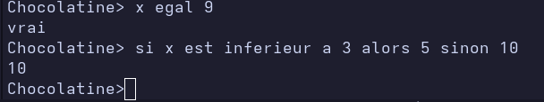

Avec des caractères :

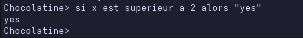

On peut utiliser les symboles arithmétiques

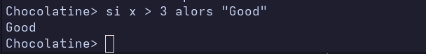

On peut faire aussi faire plusieurs conditions

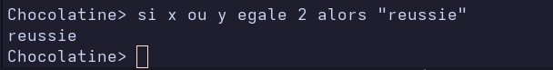

Syntaxe : 

*  `si paramètres condition alors conséquence`

Exemples : 

Si x est superieur a 10 alors afficher "x est supérieur à 10"

Si x == y alors f(x y)    (on suppose dans cet exemple que f est une fonction)

(un paramètre peut être une variable, une fonction, une valeur, une liste, un résultat...)

(une condition peut être un opérateur, une variable, une valeur, une fonction, un résultat, une liste)

(une conséquence peut être un affichage de texte, une fonction, la valeur que l'on retourne)

------------------------------------------------------

# 7. Boucles

Les boucles peuvent faire répeter une action, une fonction donnée. 
Il existe 2 types de boucles.

Boucle infini : 

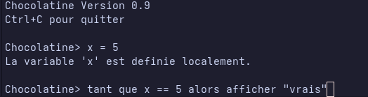

Syntaxe : 

* `tant que condition alors {consequence}`

(une conditon peut être un opérateur, une variable, n'importe quoi)

(une conséquence peut être un affichage de texte, une fonction, n'importe)

Boucle avec limites : 

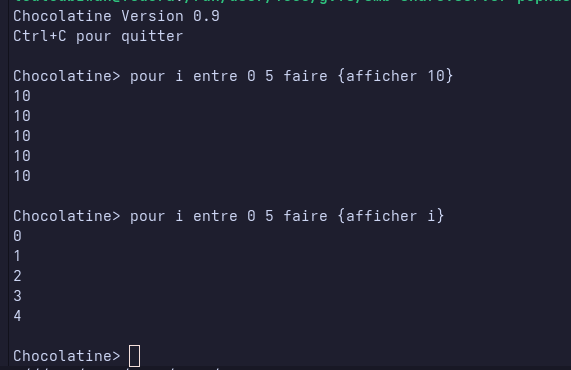

Syntaxe : 

`pour index entre valeurInitial valeurfinal faire {conséquence}`

(index peut être n'importe quel caractère, il sert à obtenir une valeur temporaire, il est souvent représenté "i")
(nombre1 et nombre2 sont des nombre choisis qui définissent le début et la fin)
(une conséquence peut être un affichage de texte, une fonction, la valeur que l'on retourne)

Exemples : 

Pour i entre 0 4 faire {afficher i + 1}

Pour Z entre X Y faire {f(Z)}   (on consédère que f est une fonction)

----------------------------------------------------------

Si vous avez des questions, des suggestions, ou si vous repérez des bugs,
n’hésitez pas à les signaler sur notre serveur Discord ou sur notre dépôt GitHub.
